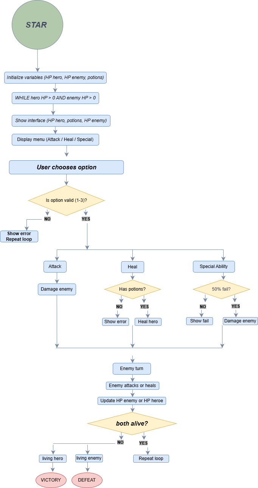

# 🕹️ Terminal Souls

A simple turn-based RPG game built in Python, played entirely in the terminal.

---

## 🎮 Description

**Terminal Souls** is a mini RPG where the player fights against an enemy using different actions such as attacking, healing, and using a special ability.

The game continues in a loop until either the hero or the enemy is defeated.

---

## ⚔️ Features

* Turn-based combat system
* Random damage system 🎲
* Critical hits 🔥
* Special ability with success/failure chance ✨
* Enemy AI (can attack or heal) 🤖
* Visual HP bars
* Potion system 🧪

---

## 🧠 Game Mechanics

### Player Actions:

1. **Attack** → Deals random damage (with a chance of critical hit)
2. **Heal** → Restores HP using potions
3. **Special Ability** → 50% chance to fail, high damage if successful

---

### Enemy Behavior:

* Attacks the player
* Can heal itself when HP is low

---

### Win Condition:

* 🏆 Win: Enemy HP reaches 0
* 💀 Lose: Hero HP reaches 0

---

## 🖥️ How to Run

1. Clone the repository:

```bash
git clone https://github.com/LaoraSad/Terminal-Souls.git
```

2. Navigate to the project folder:

```bash
cd Terminal-Souls
```

3. Run the game:

```bash
python inicio.py
```

---

## 📁 Project Structure

```
terminal-souls/
│
├── inicio.py        # Main game loop
├── funciones.py     # Game logic and functions
└── README.md
```

---

## 🛠️ Technologies Used

* Python 🐍
* Random module
* Time module

---


---

## 🗺️ Project Diagram

The project flowchart is:
<p align="center">
   
</p>

---

## 👩‍💻 Author

Created by Luisa De la Rosa, Jhonatan Rodriguez

---

